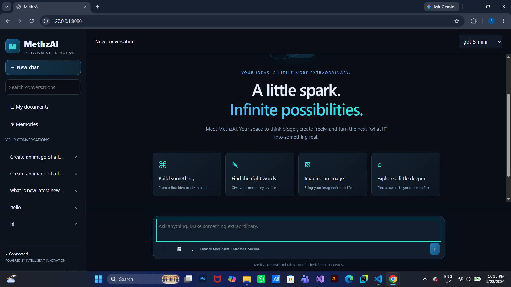
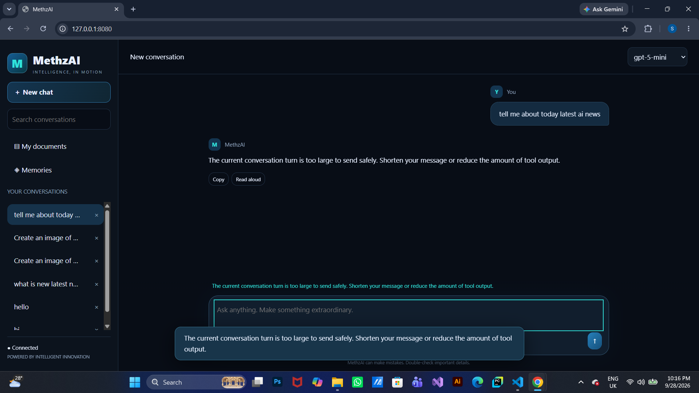
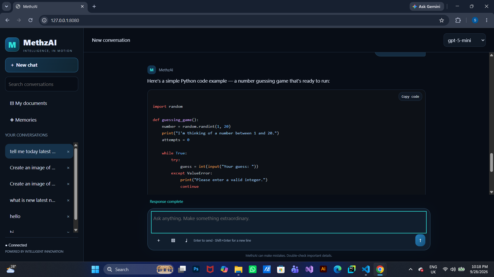
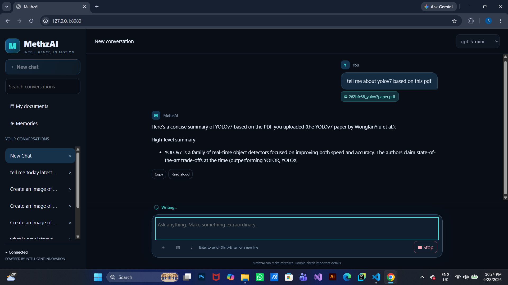
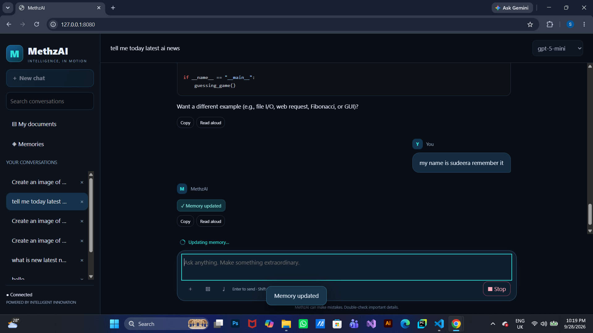
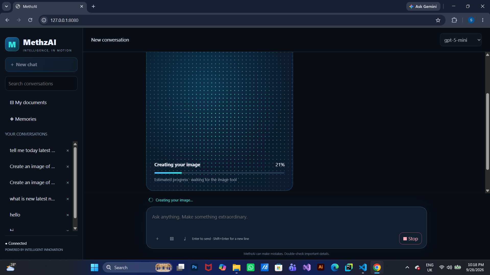
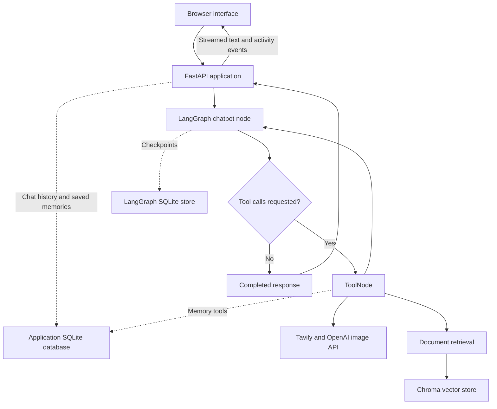

# 🤖 MethzAI — End-to-End Agentic AI Chatbot

<p align="center">
  
  
  
  
  
  
  
  
  
  
  
  
</p>

<p align="center">
  <strong>
    An end-to-end agentic AI chatbot that answers questions, searches the web,
    retrieves uploaded documents, remembers conversation-specific information,
    and generates images through a tool-enabled LangGraph workflow.
  </strong>
</p>

<p align="center">
  💬 <strong>User Message</strong> →
  🤖 <strong>Chatbot Agent</strong> →
  🧰 <strong>Tools When Needed</strong> →
  ✍️ <strong>Streamed Response</strong>
</p>

<p align="center">
  <a href="#user-interface">Screenshots</a> ·
  <a href="#installation">Installation</a>
</p>

---

## 📌 Overview

**MethzAI** is an end-to-end agentic chatbot application built using **Python, LangGraph, LangChain, OpenAI, Tavily, FastAPI, Chroma, and SQLite**.

Users provide a natural-language message. The application then follows a stateful conversation workflow:

1. **Chatbot Agent** receives the message and recent conversation context.
2. **Tool Routing** selects available tools when the model requests them.
3. **Tool Execution** retrieves information, performs calculations, saves memories, or generates images.
4. **Response Generation** uses the conversation and tool results to produce an answer.

The project combines **one tool-enabled conversational agent with six registered tools**. Tool results are returned to the agent so it can continue responding or request another tool.

A custom **blue neon HTML, CSS, and JavaScript interface** displays streamed responses, activity indicators, conversation history, document uploads, memory notifications, and image-generation progress.

The project demonstrates practical agentic AI development through graph orchestration, retrieval-augmented generation, persistent storage, API integration, and an interactive frontend.

---

## ✨ Features

- 💬 Streaming AI conversations.
- 🤖 A tool-enabled agent built with LangGraph.
- 🔀 Conditional routing between the chatbot and tools.
- 🔎 Web search using Tavily.
- 📄 Document upload and retrieval-augmented generation.
- 🧩 Text extraction from PDF, DOCX, TXT, MD, PY, and CSV files.
- 🧬 OpenAI embeddings with persistent Chroma storage.
- 🧠 Save and recall facts within the current conversation.
- 🧮 Restricted arithmetic calculations through an AST evaluator.
- 🎨 Text-to-image generation using the OpenAI Images API.
- 📥 Generated PNG image downloads.
- 🎙️ Browser-based voice-to-text input.
- 🔊 Read-aloud controls for assistant responses.
- 💻 Syntax-highlighted code blocks with copy buttons.
- 📝 Markdown rendering with HTML sanitization.
- 🗂️ Saved conversation history and sidebar search.
- 🔄 Chat-model selection from a configured allowlist.
- 💾 LangGraph checkpoints backed by SQLite.
- 🗄️ Database storage for conversations, messages, and memories.
- 🌐 FastAPI endpoints for the web application.
- ✨ Blue-to-cyan styling and a 3D-style welcome animation.
- ⏳ Activity indicators for thinking, searching, writing, and tool use.
- 📊 Estimated image-generation progress with explicit success handling.
- 📱 Responsive desktop and mobile layouts.
- 🔐 Environment-variable configuration for API credentials.
- 🧩 Separate agent, tools, RAG, database, and application modules.

---

<a id="user-interface"></a>

## 📸 User Interface

### Home Dashboard

A welcome screen with quick prompts, conversation history, document access, memory access, and model selection.

<p align="center">
  
</p>

### AI Conversations

Chat with the assistant and follow its response in the conversation workspace.

<p align="center">
  
</p>

### Code Generation

Programming responses use formatted code blocks, syntax colors, and copy controls.

<p align="center">
  
</p>

### Document Question Answering

Upload documents and ask questions that the agent answers using retrieved content.

<p align="center">
  
</p>

### Conversation Memory

Explicitly save information and recall it later in the same conversation.

<p align="center">
  
</p>

### Image Generation

Create an image from a text description, view the returned result, and download it.

<p align="center">
  
</p>

The image progress indicator is an estimate. It reaches **100% only after the backend returns a successful image result**; it does not represent an exact provider-reported percentage.

---

## 🏗️ System Architecture



The chatbot node uses `ChatOpenAI.bind_tools(...)`. LangGraph's `tools_condition` routes tool requests to `ToolNode`, then returns the tool results to the chatbot node for the next response.

The same conversation identifier is passed through the graph configuration:

```python
config = {
    "configurable": {
        "thread_id": thread_id,
    }
}
```

Tools receive the thread identifier through `RunnableConfig`, keeping document and memory operations associated with the selected conversation.

---

## 🔄 How It Works

### 1️⃣ User Enters a Message

The user enters a question through the web interface and selects an available chat model.

Example:

> Explain retrieval-augmented generation and give me a simple Python example.

### 2️⃣ FastAPI Prepares the Conversation

The backend validates the request and saves the user message. The conversation identifier is passed to LangGraph:

```python
config = {
    "configurable": {"thread_id": thread_id},
    "recursion_limit": 30,
}
```

### 3️⃣ Chatbot Agent Processes the Request

The chatbot node combines its system prompt with recent messages and calls the selected model with the available tools bound to it.

```python
llm_with_tools = llm.bind_tools(tools)

response = llm_with_tools.invoke(
    messages,
    config=config,
)
```

### 4️⃣ Tools Run When Requested

`tools_condition` routes model tool calls to `ToolNode`.

Depending on the request, a tool may:

- Search the web.
- Retrieve uploaded document content.
- Save or recall a memory.
- Calculate a result.
- Generate an image.

Tool results return to the chatbot node. The model uses them to continue the response.

### 5️⃣ Responses and Activity Are Streamed

The application consumes both message and node-update streams:

```python
for part in graph.stream(
    {"messages": [HumanMessage(content=message)]},
    config=config,
    stream_mode=["messages", "updates"],
):
    # The app converts graph output into frontend events.
    ...
```

The browser receives newline-delimited JSON events and updates the visible response and activity indicators.

### 6️⃣ Results Are Displayed and Saved

| Interface area | Contents |
| --- | --- |
| 💬 Conversation | User messages and assistant responses |
| 💻 Code blocks | Highlighted code and copy controls |
| 🧠 Memory notification | Confirmation after a successful memory save |
| 🎨 Image result | Generated image and download link |
| 🗂️ Sidebar | Saved conversation titles |
| 📄 Documents panel | Files uploaded to the selected conversation |

Assistant text, image references, and memory-update metadata are saved for later display.

---

## 🧠 Agent vs. Tools

| Component | Type | Responsibility |
| --- | --- | --- |
| 🤖 Chatbot node | Tool-enabled language-model node | Interpret requests, request tools, and generate responses |
| 🔀 `tools_condition` | Conditional routing function | Decide whether the graph should execute tools or finish |
| 🧰 `ToolNode` | Tool execution node | Execute tool calls and return results |
| 🔎 Web search | External API tool | Retrieve current information through Tavily |
| 📄 Document search | Retrieval tool | Search Chroma within the current conversation |
| 🧠 Memory tools | Database tools | Save and recall conversation-specific facts |
| 🧮 Calculator | Local computation tool | Evaluate supported arithmetic expressions |
| 🎨 Image generation | External API tool | Create and save a PNG image |

This design uses a single conversational agent with specialized tools. It does not implement separate Search, Reader, Writer, or Critic agents.

---

## 🦜 LangGraph Workflow Composition

The agent follows this graph construction pattern:

```python
workflow = StateGraph(MessagesState)

workflow.add_node("chatbot", chatbot_node)
workflow.add_node("tools", ToolNode(tools))

workflow.add_edge(START, "chatbot")
workflow.add_conditional_edges("chatbot", tools_condition)
workflow.add_edge("tools", "chatbot")

agent = workflow.compile(checkpointer=checkpointer)
```

Each component has a specific role:

| Component | Purpose |
| --- | --- |
| `MessagesState` | Maintain the conversation's message state |
| `chatbot_node` | Invoke the tool-enabled model |
| `ToolNode` | Execute model-requested tools |
| `tools_condition` | Route tool calls or finish the turn |
| `SqliteSaver` | Persist graph checkpoints by conversation |

The graph can repeat the chatbot–tool loop until the model produces a response without further tool calls or the configured recursion limit is reached.

The agent uses an approximate **4,000-token context budget** before model invocation. The persisted history remains stored; trimming does not summarize every older message or guarantee an exact token count.

---

## 🌐 AI Tools

### 🔎 Web Search

The `web_search` tool uses Tavily:

```python
web_search = TavilySearch(
    max_results=5,
    topic="general",
    search_depth="advanced",
)
```

Search results provide external information and source links for the agent to use.

### 📄 Uploaded Document Search

`search_uploaded_documents` uses the RAG pipeline in `rag.py`.

| Setting | Configuration |
| --- | --- |
| Embedding model | `text-embedding-3-small` |
| Vector database | Chroma |
| Collection | `agentic_chatbot_docs` |
| Chunk size | 900 characters |
| Chunk overlap | 150 characters |
| Default retrieval count | 4 chunks |
| Metadata filter | Current `thread_id` |

The pipeline extracts text, splits it into chunks, stores embeddings, and returns retrieved content with source labels. Uploaded Python and CSV files are read as text; they are not executed or analyzed as structured datasets.

### 🧠 Save and Recall Memory

- `remember_this` saves an explicitly requested fact or preference.
- `recall_memory` searches saved memory text or returns recent memories.

Memories are stored in SQLite and **belong to the current conversation**. They are not automatically shared across separate chats.

Memory recall uses substring matching and returns up to 20 results. It does not automatically consolidate or replace conflicting facts.

### 🧮 Calculator

The calculator supports arithmetic operators, basic functions, and selected `math` functions and constants.

Examples:

```text
2 + 2
math.sqrt(16)
sum([1, 2, 3])
round(math.pi, 2)
```

It uses a restricted AST evaluator with input and numeric limits rather than unrestricted `eval()`.

### 🎨 Image Generation

`generate_image` calls the OpenAI Images API with a text prompt.

The current request settings are:

- One image per invocation.
- `1024x1024` dimensions.
- Medium quality.
- PNG output.

The tool validates the returned data, saves a PNG, and returns success metadata. FastAPI registers the result and gives the browser an image URL.

The image model is configured through `IMAGE_MODEL`. It must be available to the API account and support the parameters used in `tools.py`.

**The current tool generates new images from text; it does not edit uploaded images.**

---

## 🛠️ Technologies Used

| Technology | Purpose |
| --- | --- |
| 🐍 Python | Core application language |
| 🦜 LangChain | Model integration, messages, and tools |
| 🔀 LangGraph | Stateful agent workflow and tool routing |
| 🤖 OpenAI | Chat models, embeddings, and image generation |
| 🔗 langchain-openai | LangChain integration with OpenAI |
| 🔎 Tavily | Web-search API |
| 🌐 FastAPI | Backend API and streamed responses |
| ⚡ Uvicorn | Application server |
| 📄 Jinja2 | Frontend template serving |
| 🧬 Chroma | Document embeddings and similarity search |
| 🗄️ SQLite | Local persistent storage |
| 🧱 SQLAlchemy | Database models and operations |
| 📑 pypdf | PDF text extraction |
| 📝 docx2txt | Word document text extraction |
| 🔐 python-dotenv | Environment-variable loading |
| 🎨 HTML + CSS | Interface structure, styling, and animations |
| ⚙️ JavaScript | Streaming, uploads, voice input, and user interaction |
| 🧰 Git | Version control |
| 🐙 GitHub | Source code hosting |

Chat-model configuration is defined in `agent.py`. Image-model configuration is defined in `tools.py`.

---

## 📦 Main Python Libraries

```text
fastapi
uvicorn
jinja2
python-multipart
python-dotenv
langchain
langchain-core
langchain-openai
langgraph
langgraph-checkpoint-sqlite
langchain-text-splitters
langchain-chroma
chromadb
langchain-tavily
tavily-python
sqlalchemy
pypdf
docx2txt
```

Install the project's pinned dependencies using `requirements.txt`.

The source also imports the OpenAI SDK and `certifi`, which may be installed transitively by the listed dependencies.

---

## 📁 Project Structure

| Path | Purpose |
| --- | --- |
| `app.py` | FastAPI application, streaming, uploads, history, and image routes |
| `agent.py` | Model selection, system prompt, graph construction, and checkpoints |
| `tools.py` | Calculator, document search, memory, web search, and image tools |
| `rag.py` | Document extraction, chunking, embeddings, and retrieval |
| `database.py` | SQLAlchemy models and conversation/memory operations |
| `templates/index.html` | Frontend markup, styles, and JavaScript |
| `templates/logo.jpeg` | Repository logo asset |
| `assets/screenshots/home.png` | Home dashboard screenshot |
| `assets/screenshots/chat.png` | Conversation screenshot |
| `assets/screenshots/code-generation.png` | Code response screenshot |
| `assets/screenshots/document-rag.png` | Document question-answering screenshot |
| `assets/screenshots/memory.png` | Memory screenshot |
| `assets/screenshots/image-generation.png` | Image-generation screenshot |
| `requirements.txt` | Python dependency versions |
| `.gitignore` | Excluded local data and environment files |
| `LICENSE` | Apache License 2.0 |
| `README.md` | Project documentation |

The application creates local runtime data:

| Local path | Contents |
| --- | --- |
| `data/langgraph_checkpoints.sqlite` | Graph checkpoints |
| `data/chatbot_memory.db` | Conversations, messages, and saved memories |
| `data/generated_images/` | Generated PNG images |
| `data/web_image_index.json` | Registered images and their conversation identifiers |
| `uploads/` | Uploaded files grouped by conversation |
| `chroma_db/` | Persistent document embeddings |

These runtime files and the local `.env` should remain excluded from Git.

---

<a id="installation"></a>

## ⚙️ Installation

### 1️⃣ Clone the Repository

```bash
git clone https://github.com/sudeeraattanayake/MethzAI.git
cd MethzAI
```

### 2️⃣ Create a Python 3.11 Virtual Environment

Python 3.11 is a suitable starting environment for this project.

#### Windows PowerShell

```powershell
py -3.11 -m venv .venv
.\.venv\Scripts\Activate.ps1
```

#### macOS / Linux

With Python 3.11 installed:

```bash
python3.11 -m venv .venv
source .venv/bin/activate
```

### 3️⃣ Install Dependencies

```bash
python -m pip install -r requirements.txt
```

### 4️⃣ Configure Environment Variables

Create `.env` beside `app.py`:

```dotenv
OPENAI_API_KEY=your_openai_api_key_here
TAVILY_API_KEY=your_tavily_api_key_here
CHAT_MODEL=gpt-5-mini

# For image generation, replace the placeholder and uncomment:
# IMAGE_MODEL=your_supported_image_model_id
```

| Variable | Purpose |
| --- | --- |
| `OPENAI_API_KEY` | Authenticate model, embedding, and image requests |
| `TAVILY_API_KEY` | Authenticate web-search requests |
| `CHAT_MODEL` | Choose the default chat model from `ALLOWED_MODELS` |
| `IMAGE_MODEL` | Override the image model configured in `tools.py` |

Configure a supported image model before using image generation. Chat-model selection in the frontend does not change the separately configured image model.

Do not commit real API keys. An optional `.env.example` should contain placeholders only.

### 5️⃣ Check the Logo Path

The repository contains `templates/logo.jpeg`, while the current `/logo` route looks for `logo.png` beside `app.py`.

Either export your logo as a real PNG named `logo.png` in the project root, or update the existing route to serve the repository's JPEG:

```python
@app.get("/logo")
def logo():
    path = BASE_DIR / "templates" / "logo.jpeg"
    if not path.is_file():
        raise HTTPException(404, "Logo not found.")
    return FileResponse(path, media_type="image/jpeg")
```

The frontend shows a letter fallback if the image is unavailable.

### 6️⃣ Run MethzAI

```bash
python app.py
```

Open **http://127.0.0.1:8080**.

FastAPI's interactive API documentation is available at **http://127.0.0.1:8080/docs**.

For development with automatic reload:

```bash
python -m uvicorn app:app --host 127.0.0.1 --port 8080 --reload
```

Run one server worker with the current implementation, which uses in-process conversation locks and a local image index. Open the frontend through FastAPI rather than through VS Code Live Server.

---

## 🔐 Environment Configuration

Environment variables are loaded with `python-dotenv`:

```python
from dotenv import load_dotenv

load_dotenv()
```

Credentials and model configuration are read from the environment:

```python
import os

OPENAI_API_KEY = os.getenv("OPENAI_API_KEY")
TAVILY_API_KEY = os.getenv("TAVILY_API_KEY")
DEFAULT_MODEL = os.getenv("CHAT_MODEL", "gpt-5-mini")
```

### Chat Model Selection

The current allowlist in `agent.py` contains:

```text
gpt-5-mini
gpt-5
gpt-5-nano
gpt-4.1
gpt-4.1-mini
gpt-4o
gpt-4
gpt-3.5-turbo
```

The default is `gpt-5-mini` unless `CHAT_MODEL` specifies another allowed model. An invalid configured default falls back to `gpt-5-mini`.

These are configured model choices, not a guarantee of current provider availability or account access. Image generation uses the separately configured `IMAGE_MODEL`.

**Never commit real API keys to GitHub.**

An optional `.env.example` should contain placeholders only.

---

## 💻 Run the Agent from the Terminal

The agent can also be invoked without the web interface.

For an optional text-streaming example, save the following as `run_agent.py` in the project root:

```python
from langchain_core.messages import AIMessageChunk, HumanMessage
from agent import get_agent
from database import init_db


def main():
    init_db()
    agent = get_agent("gpt-5-mini")

    config = {
        "configurable": {"thread_id": "terminal_demo"},
        "recursion_limit": 30,
    }

    for chunk, metadata in agent.stream(
        {"messages": [HumanMessage(content="Explain machine learning simply.")]},
        config=config,
        stream_mode="messages",
    ):
        if metadata.get("langgraph_node") != "chatbot":
            continue
        if isinstance(chunk, AIMessageChunk) and isinstance(chunk.content, str):
            print(chunk.content, end="", flush=True)

    print()


if __name__ == "__main__":
    main()
```

Run:

```bash
python run_agent.py
```

This optional example uses the configured APIs and graph checkpoints. The web application's separate chat-history records and frontend activity events are managed by `app.py`; this short terminal example does not reproduce those features.

### Web Stream Events

| Event | Contents |
| --- | --- |
| `status` | Current application or tool activity |
| `token` | Assistant response text |
| `memory` | Successful memory-save notification |
| `image` | Registered image URL and metadata |
| `tool_error` | Tool failure message |
| `error` | Request failure message |
| `done` | Request completion and optional warning |
| `heartbeat` | Connection activity while waiting |

---

## 🎨 Frontend and Animations

The frontend uses a dark workspace with blue and cyan accents, a conversation sidebar, and a central chat area.

### Active-Stage Effects

- Animated 3D-style welcome element.
- Rotating activity spinner.
- Labels for thinking, searching, calculating, and writing.
- Memory-save and recall activity indicators.
- Animated dotted placeholder during image generation.
- Estimated image progress bar.

### Completion Indicators

- Memory-update badge after a successful save.
- Completed response status.
- Generated image reveal.
- Image download control.

### Rendering

The HTML template is served through FastAPI and Jinja2:

```python
return templates.TemplateResponse(
    request=request,
    name="index.html",
    context={},
)
```

The browser uses:

| Library | Purpose |
| --- | --- |
| Marked | Parse Markdown responses |
| DOMPurify | Sanitize rendered HTML |
| Highlight.js | Add syntax colors to code blocks |

The current frontend loads these libraries from CDNs. It falls back to plain text if Markdown dependencies are unavailable. Displayed code is not executed by the browser.

### Voice Input and Read Aloud

The microphone uses browser speech recognition to convert speech into text. Users review the transcript before sending it. Assistant messages can be read with browser speech synthesis.

Speech support depends on the browser, microphone permissions, and its speech service. The initial recognition language follows the browser language setting.

### Progress Behavior

Activity labels reflect application and tool events, not private model reasoning.

Image progress is **estimated**: it advances toward 95% while waiting and reaches 100% after a successful image result. The placeholder does not show real intermediate image previews.

The **Stop** button stops receiving the stream. Already-started backend operations may still finish, incur API usage, and save their results.

---

## 📥 Exporting Results

### Generated Images

Use the download link beneath a completed image to save its PNG file.

Images are served through a registered backend route:

```text
/api/images/{filename}?download=1
```

### Code and Responses

- **Copy code** copies an individual code block.
- **Copy** copies an assistant response.
- **Read aloud** uses browser speech synthesis when available.

### Saved Conversations

Conversations can be reopened through the sidebar. The current interface does not provide a complete conversation export as Markdown, PDF, or JSON.

---

## 💬 Example Prompts

### General Learning

> Explain overfitting with a simple example.

### Software Engineering

> Write a Python function that removes duplicate items while preserving order.

### Blog Writing

> Write a beginner-friendly blog about machine learning.

### Web Research

> Search the web for recent AI developments and include source links.

### Retrieval-Augmented Generation

> Summarize the main points of the document I uploaded.

### Conversation Memory

> Remember that my name is Sudeera and I prefer Python examples.

Later, in the same conversation:

> What have I asked you to remember?

### Image Generation

> Create a futuristic city at night with neon blue lights and cinematic rain.

---

## 🧩 Error Handling

The application reports request and tool failures in the interface and logs detailed exceptions in the Python terminal.

Possible failures include:

- Missing or invalid API credentials.
- Provider rate or usage limits.
- Unavailable chat or image models.
- Network timeouts.
- Unsupported upload formats or oversized files.
- Documents without extractable text.
- Image-generation or image-saving failures.
- Database errors.

A second write operation for a conversation is rejected while its previous operation is still running.

Memory and image success indicators are shown only after successful tool results. Errors are not presented as completed work.

If an older database has a different schema, back it up and migrate it. `init_db()` creates missing tables but does not migrate existing columns.

---

## ⚠️ Current Limitations

- This is a local development application without user accounts or per-user authorization.
- Conversation identifiers separate data logically; they are not an authentication mechanism.
- Memory is conversation-scoped and uses text matching rather than semantic recall.
- Uploaded documents require extractable text; OCR is not implemented.
- Uploading the same document again can create duplicate indexed content.
- Retrieval returns nearby chunks, which may be incomplete or irrelevant to a question.
- Image generation does not support editing an uploaded image or returning real partial-image previews.
- Voice input is browser-based transcription, not uploaded audio-message processing.
- Stopping the frontend stream does not guarantee cancellation of external API work.
- Local conversation cleanup spans multiple stores and is not a single atomic transaction.
- Model outputs and source references should be checked before relying on important claims.

API calls may incur charges. Public deployment requires additional authentication, ownership checks, rate limits, and a storage/concurrency design suitable for multiple users and workers.

---

## 🎯 Project Objectives

- Build a complete conversational application around a stateful agent.
- Integrate model calls with search, calculation, memory, and image tools.
- Implement document ingestion and retrieval-augmented generation.
- Preserve conversations with database-backed persistence.
- Connect LangGraph streaming to a JavaScript frontend.
- Display tool activity without inventing completion results.
- Keep backend responsibilities separated into reusable modules.

---

## 📚 Learning Areas

### 🐍 Python

- Modular application development.
- Reusable tool functions.
- API integration and environment variables.
- Exception handling and validation.
- Restricted expression evaluation.

### 🦜 LangChain and LangGraph

- Tool binding and model invocation.
- Message-based state.
- Conditional graph edges.
- Tool execution and result handling.
- Streaming and persistent checkpoints.

### 📄 Retrieval-Augmented Generation

- Document text extraction.
- Overlapping text chunks.
- Embedding generation.
- Persistent vector storage.
- Conversation-based metadata filtering.

### 🌐 FastAPI and Frontend

- HTTP routes and request models.
- Multipart document uploads.
- Streamed JSON responses.
- JavaScript Fetch streams and DOM updates.
- Markdown, syntax highlighting, and responsive CSS.

### 🧠 Persistence and Workflow Design

- Conversation identifiers.
- SQLite and SQLAlchemy models.
- Separate checkpoints, chat records, and explicit memories.
- Visible tool activity and failure handling.
- Approximate model-context management.

---

## 🚀 Future Improvements

- [ ] Add authentication and per-user data ownership.
- [ ] Introduce a user-level memory design with explicit privacy controls.
- [ ] Add semantic memory retrieval and fact-update handling.
- [ ] Support OCR for scanned documents.
- [ ] Add document deduplication and per-document deletion.
- [ ] Add automated tests and end-to-end evaluation datasets.
- [ ] Track token usage, latency, and API costs.
- [ ] Add LangSmith tracing configuration and evaluation workflows.
- [ ] Add supported provider cancellation or managed background jobs.
- [ ] Add server-side speech transcription.
- [ ] Add containerization, CI, and deployment documentation.

These are proposed extensions, not claims about current functionality.

---

## 🔒 Configuration Hygiene

Keep API credentials, generated content, local databases, and virtual environments out of version control:

```gitignore
.env
.env.*
!.env.example

.venv/
venv/
__pycache__/
*.py[cod]

data/
uploads/
chroma_db/
*.db
*.db-*
*.sqlite
*.sqlite-*
*.sqlite3
*.sqlite3-*

*.log
```

Keep only intentional, non-sensitive demonstration screenshots in `assets/screenshots/`. If a secret has already been committed, ignoring the file does not remove that secret from Git history; revoke the exposed credential.

---

## ⭐ Project Highlights

### 🤖 Tool-Enabled Conversations

A LangGraph agent combines natural-language responses with specialized tools for research, calculations, memory, and images.

### 🔎 External Information Retrieval

Tavily search and uploaded-document retrieval provide information beyond the model's internal knowledge.

### 🧠 Persistent Conversation State

SQLite checkpoints preserve graph state, while application tables store displayable messages and conversation-specific memories.

### 🎨 Visible Workflow Execution

The blue neon interface shows streamed answers, current tool activity, memory-save confirmations, and image-generation status.

### 📦 Reusable Outputs

Users can copy responses and code blocks, download generated images, and return to saved conversations.

### 🧩 Modular Project Structure

Agent orchestration, tools, document retrieval, database operations, and web routes are organized into separate Python modules.

---

## 📌 Repository

**[MethzAI — End-to-End Agentic AI Chatbot](https://github.com/sudeeraattanayake/MethzAI)**

---

## 📄 License

This project is licensed under the **Apache License 2.0**. See [`LICENSE`](LICENSE) for the full terms.

---

## 👨‍💻 Author

**Sudeera Attanayake**

Generative AI | LLM Applications | AI Agents | Python

**[GitHub Profile](https://github.com/sudeeraattanayake)**

---

## 🤝 Support

If you find this project useful:

- ⭐ Star the repository.
- 🐛 Report issues.
- 💡 Suggest improvements.
- 📚 Explore the implementation.

---

<p align="center">
  <strong>
    Built with 🐍 Python + 🦜 LangGraph + 🤖 OpenAI + 🔎 Tavily + 🌐 FastAPI
  </strong>
</p>

<p align="center">
  <strong>✦ MethzAI — A little spark. Infinite possibilities.</strong>
</p>
