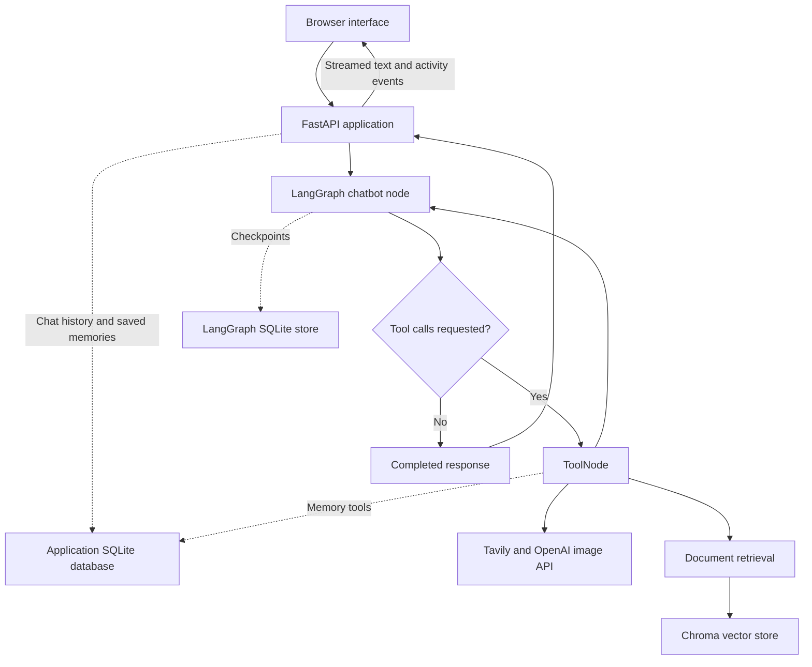

🤖 MethzAI — End-to-End Agentic AI Chatbot

  
  
  
  
  
  
  
  
  
  
  

  <strong>
    A conversational AI workspace that combines streaming chat, document retrieval,
    web search, persistent memory, image generation, and voice-to-text input.
  </strong>

  💬 <strong>Chat</strong> ·
  📄 <strong>Document RAG</strong> ·
  🔎 <strong>Web Search</strong> ·
  🧠 <strong>Memory</strong> ·
  🎨 <strong>Image Generation</strong>

  <a href="#overview">Overview</a> ·
  <a href="#screenshots">Screenshots</a> ·
  <a href="#architecture">Architecture</a> ·
  <a href="#installation">Installation</a> ·
  <a href="#example-prompts">Example Prompts</a>

📌 Overview
MethzAI is an end-to-end agentic chatbot built with Python, FastAPI, LangGraph, LangChain, OpenAI, Tavily, Chroma, and SQLite.
Users interact through a responsive HTML, CSS, and JavaScript interface. A tool-enabled language model can answer questions, retrieve uploaded document content, search the web, calculate results, save conversation-specific facts, and generate images.
The application combines:
- LangGraph for the model–tool execution loop and conversation checkpoints.
- FastAPI for chat streaming, uploads, history, memory, and image endpoints.
- Chroma for document embeddings and similarity search.
- SQLAlchemy and SQLite for saved conversations, messages, and memories.
- A blue-to-cyan interface with animated activity indicators, code highlighting, and image downloads.
MethzAI uses one tool-enabled conversational agent. The available tools provide specialized capabilities within that agent's workflow.
✨ Features
💬 Conversations
- Stream assistant text into the browser as it is generated.
- Create and reopen separate conversation threads.
- Search saved conversation titles in the sidebar.
- Select a configured chat model from the interface.
- Persist chat history across application restarts.
- Delete a conversation and its associated local data.
📄 Documents and Research
- Upload PDF, DOCX, TXT, Markdown, Python, and CSV files.
- Split extracted text into overlapping chunks.
- Generate embeddings with text-embedding-3-small.
- Retrieve relevant document chunks using Chroma.
- Filter document retrieval by the current conversation.
- Search the web using Tavily.
- Return document references and web links when available.
🧠 Tools and Memory
- Save explicitly requested facts and preferences.
- Recall saved memories from the current conversation.
- Show a memory-update badge after a successful save.
- Calculate arithmetic expressions with a restricted AST evaluator.
- Generate new images from text prompts and download the resulting PNGs.
🎨 Interface
- Dark theme with neon blue and cyan accents.
- Animated 3D-style welcome element.
- Thinking, searching, writing, memory, and image-generation indicators.
- Animated image placeholder with estimated progress.
- Markdown responses, syntax-highlighted code, and copy buttons.
- Browser-based voice-to-text input and read-aloud controls.
- Responsive desktop and mobile layouts.
- Reduced-motion support.

📸 User Interface
🏠 Home
A welcome screen with quick prompts, conversation history, document access, memory access, and model selection.

  

💬 AI Conversations
Chat with the assistant and follow its response in the conversation workspace.

  

💻 Code Generation
Programming responses use formatted code blocks, syntax colors, and copy controls.

  

📄 Document Question Answering
Upload documents and ask questions that the agent answers using retrieved content.

  

🧠 Conversation Memory
Explicitly save information and recall it later in the same conversation.

  

🎨 Image Generation
Create an image from a text description, view the returned result, and download it.

  

The image progress indicator is an estimate. It reaches 100% only after the backend returns a successful image result; it does not represent an exact provider-reported percentage.

🏗️ System Architecture

The chatbot node uses ChatOpenAI.bind_tools(...). LangGraph's tools_condition routes tool requests to ToolNode, then returns the tool results to the chatbot node for the next response.
The same conversation identifier is passed through the graph configuration:
config = {
    "configurable": {
        "thread_id": thread_id,
    }
}
Tools receive the thread identifier through RunnableConfig, keeping document and memory operations associated with the selected conversation.
🔄 How It Works
1️⃣ Choose a Conversation and Model
The frontend creates a thread or opens one from saved history. Available model choices are loaded from the backend.
2️⃣ Send a Message
The browser sends the message, model name, thread identifier, and attachment references to POST /api/chat.
3️⃣ Run the Agent
The backend saves the user message and invokes the graph. The model can respond directly or request an available tool.
4️⃣ Execute Tools When Needed
Tool results are added to graph state. The chatbot node uses those results to continue the conversation.
5️⃣ Stream Text and Activity
FastAPI returns newline-delimited JSON events. The browser uses them to append response text, update activity labels, display saved-memory notifications, and show generated images.
6️⃣ Save the Result
The application stores the assistant response and associated metadata so the conversation can be reopened later.
🧰 Available Tools
Tool	Responsibility
calculator	Evaluate supported arithmetic expressions and selected mathematical functions
search_uploaded_documents	Retrieve document chunks from the current conversation
remember_this	Save a requested fact or preference for the current conversation
recall_memory	Search saved memories using a short phrase, or retrieve recent memories
web_search	Search the web through TavilySearch
generate_image	Generate a new PNG image from a text description

Tavily is configured with max_results=5, the general topic, and advanced search depth.
The calculator supports operations such as +, -, *, /, //, %, and **, along with selected functions such as math.sqrt, round, and sum. It uses an allowlisted AST evaluator rather than unrestricted eval().
📄 Retrieval-Augmented Generation
The document workflow is implemented in [`rag.py`](rag.py):
1. Extract text from the uploaded file.
2. Split the text with RecursiveCharacterTextSplitter.
3. Add the conversation identifier and source filename as metadata.
4. Embed the chunks and store them in persistent Chroma storage.
5. Retrieve relevant chunks for the user's query.
6. Return the selected content with source labels to the agent.
Setting	Current configuration
Embedding model	text-embedding-3-small
Vector store	Chroma
Collection	agentic_chatbot_docs
Chunk size	900 characters
Chunk overlap	150 characters
Default retrieved chunks	4
Retrieval filter	Current thread_id
Upload formats	PDF, DOCX, TXT, MD, PY, CSV
Upload limit	Up to 5 files per request, 10 MB per file

PDF extraction reads embedded text. Scanned PDFs require OCR, which is not included in the current document pipeline. CSV and Python files are treated as text documents rather than executed or processed as structured datasets.
🧠 Persistence and Memory
MethzAI separates three kinds of stored information:
Store	Purpose
LangGraph checkpoints	Preserve graph state and message history for each thread
Application database	Store conversation titles, displayable messages, and saved memories
Chroma	Store document chunks, embeddings, and retrieval metadata

Conversation History
LangGraph uses SqliteSaver. The web interface loads its saved conversations and messages through the application's database endpoints.
Explicit Memory
The remember_this tool stores a requested fact. The recall_memory tool searches saved memory text, returning up to 20 recent matches.
Memory is scoped to a conversation, not to a global user profile. Opening a new conversation does not automatically share the previous thread's saved memories.
The current memory search uses substring matching. It is separate from semantic document retrieval and does not automatically merge or replace older facts.
Context Management
The agent trims the context sent to the model using an approximate 4,000-token budget while keeping the full persisted history. This limits input context; it is not a summary of all older messages or an exact token guarantee.
🎨 Image Generation
The image tool calls the OpenAI Images API and requests:
- One image per tool invocation.
- 1024x1024 dimensions.
- Medium quality.
- PNG output.
Successful results are decoded, checked for a PNG signature, saved locally, and registered by the backend. The frontend receives a browser-accessible image URL rather than a local filesystem path.
The image model is configured through IMAGE_MODEL. Set it to a model available to your API account that supports the parameters used in [`tools.py`](tools.py). A model name in configuration does not guarantee provider availability or account access.
This tool generates new images from text. It does not edit uploaded images.
🎙️ Voice and Response Rendering
Voice Input
The microphone uses the browser's SpeechRecognition or webkitSpeechRecognition API to convert speech into text. Review the transcript before sending it.
Availability depends on browser support, microphone permission, and the browser's speech service. The initial recognition language follows the browser's language setting.
Read Aloud
Assistant responses can be read using browser speech synthesis when supported.
Markdown and Code
The interface uses:
Library	Purpose
Marked	Parse Markdown responses
DOMPurify	Sanitize rendered HTML
Highlight.js	Highlight code syntax

These libraries are loaded from CDNs in the current frontend. If Markdown dependencies are unavailable, responses fall back to plain text. Generated code is displayed for copying; the interface does not execute it.
⏳ Activity and Progress
Activity	Meaning
Thinking	The backend has started the request
Searching the web	The agent requested the web-search tool
Searching your documents	Document retrieval was requested
Calculating	The calculator tool was requested
Updating memory	The memory-save tool was requested
Memory updated	The tool reported a successful save
Creating your image	The image-generation tool was requested
Writing	Assistant response text is streaming

Activity labels describe application events; they do not expose the model's private reasoning.
Image progress advances toward 95% while waiting and reaches 100% after a successful image result. The animated placeholder is not a partially generated image preview.
The Stop control stops receiving the stream. An already-started backend operation may continue, incur API usage, and save its result. Reopen the conversation after it finishes to retrieve the saved answer.
🛠️ Technologies Used
Technology	Purpose
Python	Backend application and tool logic
FastAPI and Uvicorn	HTTP endpoints and local application server
Jinja2	Serve the frontend template
LangGraph	Stateful agent workflow and conditional tool routing
LangChain Core / OpenAI integration	Messages, tools, model calls, and embeddings
OpenAI SDK	Image-generation requests
Tavily	Web-search API
Chroma	Persistent document vector store
SQLAlchemy and SQLite	Conversation and memory persistence
pypdf and docx2txt	PDF and Word text extraction
HTML, CSS, JavaScript	Responsive chat interface and animations
python-dotenv	Environment configuration
certifi	Certificate bundle configuration
Git and GitHub	Version control and source hosting

Use [`requirements.txt`](requirements.txt) for the repository's dependency pins. The source also imports openai and certifi, which may be installed transitively by those dependencies.
📁 Project Structure
Path	Purpose
app.py	FastAPI application, streaming, uploads, history, and image routes
agent.py	Model selection, system prompt, graph construction, and checkpoints
tools.py	Calculator, document search, memory, web search, and image tools
rag.py	Document extraction, chunking, embeddings, and retrieval
database.py	SQLAlchemy models and conversation/memory operations
templates/index.html	Frontend markup, styles, and JavaScript
templates/logo.jpeg	Repository logo asset
assets/screenshots/	Six interface screenshots used in this README
requirements.txt	Python dependency versions
.gitignore	Excluded local data and environment files
LICENSE	Apache License 2.0
README.md	Project documentation

The application creates local runtime data:
Local path	Contents
data/langgraph_checkpoints.sqlite	Graph checkpoints
data/chatbot_memory.db	Conversations, messages, and saved memories
data/generated_images/	Generated PNG images
data/web_image_index.json	Registered images and their conversation identifiers
uploads/	Uploaded files grouped by conversation
chroma_db/	Persistent document embeddings

These runtime files and the local .env should remain excluded from Git.

⚙️ Installation
1️⃣ Clone the Repository
git clone https://github.com/sudeeraattanayake/MethzAI.git
cd MethzAI
2️⃣ Create a Virtual Environment
Python 3.11 is a suitable starting environment for this project.
Windows PowerShell
py -3.11 -m venv .venv
.\.venv\Scripts\Activate.ps1
macOS / Linux, with Python 3.11 installed:
python3.11 -m venv .venv
source .venv/bin/activate
3️⃣ Install Dependencies
python -m pip install -r requirements.txt
4️⃣ Configure Environment Variables
Create .env beside app.py:
OPENAI_API_KEY=your_openai_api_key_here
TAVILY_API_KEY=your_tavily_api_key_here
CHAT_MODEL=gpt-5-mini

# For image generation, replace the placeholder and uncomment:
# IMAGE_MODEL=your_supported_image_model_id
Variable	Purpose
OPENAI_API_KEY	Authenticate model, embedding, and image requests
TAVILY_API_KEY	Authenticate web-search requests
CHAT_MODEL	Choose the default chat model from ALLOWED_MODELS
IMAGE_MODEL	Override the image model configured in tools.py

Configure a supported image model before using image generation. Chat-model selection in the frontend does not change the separately configured image model.
Do not commit real API keys. An optional .env.example should contain placeholders only.
5️⃣ Check the Logo Path
The repository contains templates/logo.jpeg, while the current /logo route looks for logo.png beside app.py.
Either export your logo as a real PNG named logo.png in the project root, or update the existing route to serve the repository's JPEG:
@app.get("/logo")
def logo():
    path = BASE_DIR / "templates" / "logo.jpeg"
    if not path.is_file():
        raise HTTPException(404, "Logo not found.")
    return FileResponse(path, media_type="image/jpeg")
The frontend shows a letter fallback if the image is unavailable.
6️⃣ Run MethzAI
python app.py
Open http://127.0.0.1:8080.
FastAPI's interactive API documentation is available at http://127.0.0.1:8080/docs.
For development with automatic reload:
python -m uvicorn app:app --host 127.0.0.1 --port 8080 --reload
Run one server worker with the current implementation, which uses in-process conversation locks and a local image index. Open the frontend through FastAPI rather than through VS Code Live Server.
🤖 Model Configuration
The default chat model is gpt-5-mini unless CHAT_MODEL specifies another allowed model. An invalid configured default falls back to gpt-5-mini.
The current allowlist in [`agent.py`](agent.py) contains:
gpt-5-mini
gpt-5
gpt-5-nano
gpt-4.1
gpt-4.1-mini
gpt-4o
gpt-4
gpt-3.5-turbo
These are application configuration entries, not a guarantee that every model is currently available. Requests depend on provider support, API permissions, and tool-calling compatibility.
Agent instances are cached by model. The model context is prepared for each request, and the conversation identifier determines the checkpoint thread.
🌐 API Endpoints
Method	Route	Purpose
GET	/	Serve the chat interface
GET	/logo	Serve the configured logo asset
GET	/api/models	Return allowed models and the default
GET	/api/conversations	List saved conversations
GET	/api/conversations/{thread_id}/messages	Load a conversation's messages
DELETE	/api/conversations/{thread_id}	Delete a conversation and associated data
GET	/api/documents?thread_id=...	List uploaded documents
GET	/api/memories?thread_id=...	List saved memories
POST	/api/upload	Upload and index documents
POST	/api/chat	Stream a conversation response
GET	/api/images/{filename}	Serve a registered generated image

Add ?download=1 to a generated image URL to download it.
Chat events use newline-delimited JSON, including status, token, memory, image, tool_error, error, done, and heartbeat events.

💬 Example Prompts
Capability	Example
General explanation	Explain overfitting with a simple example.
Programming	Write a Python function that removes duplicate items while preserving order.
Blog writing	Write a beginner-friendly blog about machine learning.
Web search	Search the web for recent AI developments and include source links.
Document RAG	Summarize the main points of the document I uploaded.
Save memory	Remember that my name is Sudeera and I prefer Python examples.
Recall memory	What have I asked you to remember in this conversation?
Calculator	Calculate 125 × 18 + 450.
Image generation	Create a futuristic city at night with neon blue lights and cinematic rain.

🧩 Troubleshooting
Issue	What to check
Frontend shows Offline	Start FastAPI and open its URL rather than the HTML file directly
Model access denied or unavailable	Check the API key, selected model, and account access
Rate or usage limit reached	Check provider quota and billing
Image generation fails	Check IMAGE_MODEL, supported request parameters, and terminal logs
Logo shows a letter instead	Match the /logo route to the actual logo path and file format
PDF upload has no text	Check whether the PDF is scanned; OCR is not included
Memory is not found in a new chat	Memories belong to their original conversation
Memory search misses a fact	Try a shorter matching phrase; recall uses substring search
Voice input is unavailable	Check browser support and microphone permission
Conversation is still processing	Wait for its current operation to finish, including after Stop
Database column mismatch	Back up the database and migrate the old schema; create_all() does not migrate existing tables

Detailed errors are logged in the Python terminal. User-facing errors do not imply that a tool completed successfully.
⚠️ Current Limitations
- This is a local development application without user accounts or per-user authorization.
- Conversation identifiers separate data logically; they are not an authentication mechanism.
- Memory is conversation-scoped and uses text matching rather than semantic recall.
- Uploaded documents require extractable text; OCR is not implemented.
- Uploading the same document again can create duplicate indexed content.
- Retrieval returns nearby chunks, which may be incomplete or irrelevant to a question.
- Image generation does not support editing an uploaded image or returning real partial-image previews.
- Voice input is browser-based transcription, not uploaded audio-message processing.
- Stopping the frontend stream does not guarantee cancellation of external API work.
- Local conversation cleanup spans multiple stores and is not a single atomic transaction.
- Model outputs and source references should be checked before relying on important claims.
API calls may incur charges. Public deployment requires additional authentication, ownership checks, rate limits, and a storage/concurrency design suitable for multiple users and workers.
🎯 Project Objectives
- Build a complete conversational application around a stateful agent.
- Integrate model calls with search, calculation, memory, and image tools.
- Implement document ingestion and retrieval-augmented generation.
- Preserve conversations with database-backed persistence.
- Connect LangGraph streaming to a JavaScript frontend.
- Display tool activity without inventing completion results.
- Keep backend responsibilities separated into reusable modules.
📚 Learning Areas
Area	Concepts demonstrated
Agentic AI	Tool binding, conditional routing, and model–tool loops
LangGraph	StateGraph, MessagesState, ToolNode, streaming, and checkpoints
RAG	Text extraction, chunking, embeddings, metadata filters, and retrieval
Backend engineering	FastAPI routes, request validation, uploads, and streamed responses
Persistence	SQLAlchemy models, SQLite storage, and conversation identifiers
Frontend engineering	Fetch streams, DOM updates, Markdown rendering, and responsive CSS
Tool integration	External APIs, error handling, and explicit success signals

🚀 Future Improvements
- [ ] Add authentication and per-user data ownership.
- [ ] Introduce a user-level memory design with explicit privacy controls.
- [ ] Add semantic memory retrieval and fact-update handling.
- [ ] Support OCR for scanned documents.
- [ ] Add document deduplication and per-document deletion.
- [ ] Add automated tests and end-to-end evaluation datasets.
- [ ] Track token usage, latency, and API costs.
- [ ] Add LangSmith tracing configuration and evaluation workflows.
- [ ] Add supported provider cancellation or managed background jobs.
- [ ] Add server-side speech transcription.
- [ ] Add containerization, CI, and deployment documentation.
These are proposed extensions, not claims about current functionality.
🔐 Configuration Hygiene
Keep API credentials, generated content, local databases, and virtual environments out of version control:
.env
.env.*
!.env.example

.venv/
venv/
__pycache__/
*.py[cod]

data/
uploads/
chroma_db/
*.db
*.db-*
*.sqlite
*.sqlite-*
*.sqlite3
*.sqlite3-*

*.log
Keep only intentional, non-sensitive demonstration screenshots in assets/screenshots/. If a secret has already been committed, ignoring the file does not remove that secret from Git history; revoke the exposed credential.
📄 License
This project is licensed under the Apache License 2.0. See LICENSE for the full terms.
👨‍💻 Author
Sudeera Attanayake
Generative AI · LLM Applications · AI Agents · Python
GitHub Profile · MethzAI Repository
🤝 Support
If you find MethzAI useful:
- ⭐ Star the repository.
- 🐛 Report reproducible issues.
- 💡 Suggest improvements.
- 📚 Explore the implementation and share what you learn.

  <strong>Built with Python · FastAPI · LangGraph · OpenAI · Chroma · Tavily</strong>

  <strong>✦ MethzAI — A little spark. Infinite possibilities.</strong>

